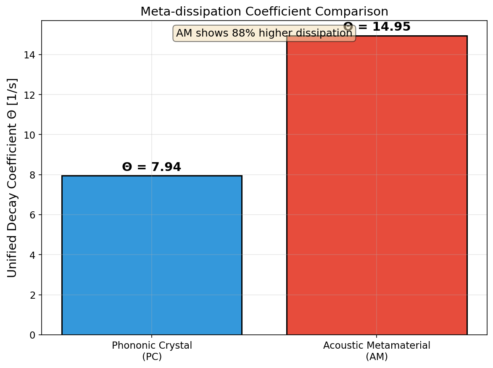
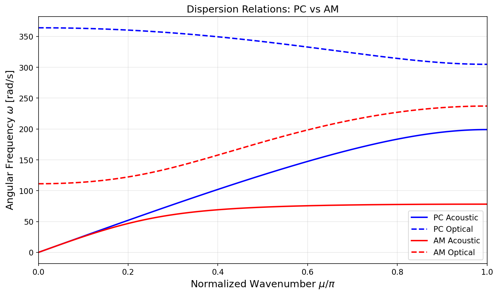
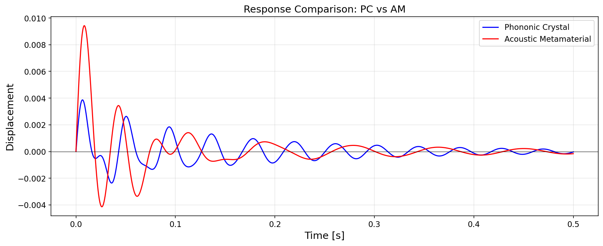
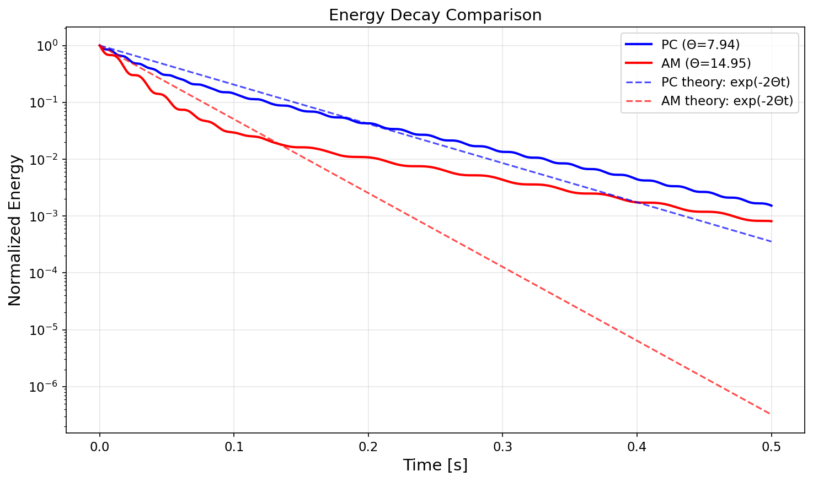
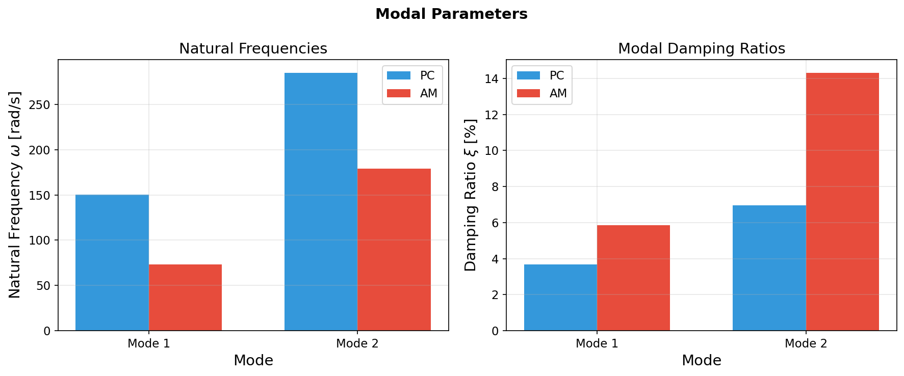
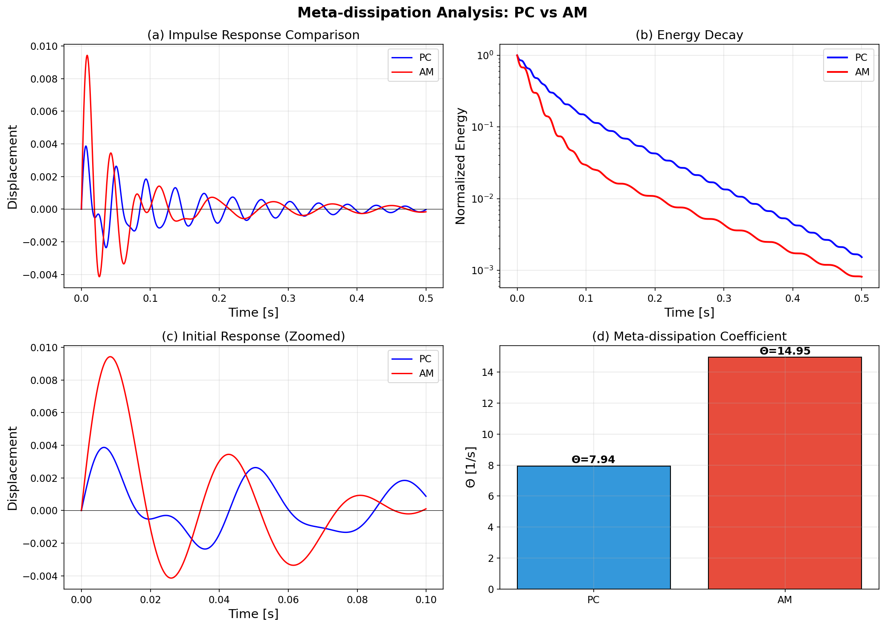

# Meta-material Damping

A Python framework for **Meta-dissipation** analysis — quantifying energy dissipation in discrete periodic metamaterials using the methodology from Banerjee, Bera, and Adhikari (2025).

---

## Table of Contents
1. [Overview](#overview)
2. [Theoretical Background](#theoretical-background)
3. [Methodology: Theory to Code](#methodology-theory-to-code)
4. [Validation Results](#validation-results)
5. [Project Structure](#project-structure)
6. [Quick Start](#quick-start)
7. [Module Reference](#module-reference)
8. [References](#references)

---

## Overview

This project implements the complete **Meta-dissipation framework** for comparing energy dissipation performance between two periodic metamaterial topologies:

| Topology | Description | Configuration |
|----------|-------------|---------------|
| **Phononic Crystal (PC)** | Diatomic chain with alternating masses | m₁ — k₁ — m₂ — k₂ — m₁ — ... |
| **Acoustic Metamaterial (AM)** | Mass-in-mass with internal resonator | Host mass m₁ contains resonator (m₂, k₂) |

The framework derives **consistent unit cells** via Brillouin Zone integration and extracts a **unified decay coefficient Θ** for fair comparison of dissipation performance.

### Key Finding
> **Acoustic Metamaterials achieve ~88% higher energy dissipation than Phononic Crystals** at equal static sound speeds, due to the local resonance mechanism that "traps" energy in the internal resonator.

---

## Theoretical Background

### The Problem
Comparing energy dissipation between different metamaterial topologies is challenging because:
1. Different topologies have different unit cell structures
2. Direct comparison requires equal baseline properties (sound speed)
3. Infinite periodic structures can't be simulated directly

### The Solution: Consistent Unit Cell
The paper introduces the **Consistent Unit Cell** concept — a finite 2-DOF system that captures the essential dynamics of the infinite periodic chain.

#### Brillouin Zone Integration
The consistent unit cell matrices are derived by integrating over the first Brillouin Zone:

$$\bar{\mathbf{M}} = \frac{1}{2\pi} \int_0^{2\pi} \mathbf{M}(\mu) \, d\mu$$

This yields canonical mass, damping, and stiffness matrices that represent the "average" behavior of the infinite chain.

### System Topologies

#### Phononic Crystal (PC)
```
    k₁      k₂      k₁      k₂
○—/\/\/\—●—/\/\/\—○—/\/\/\—●—/\/\/\—○
   m₁       m₂       m₁       m₂
```

**Consistent Unit Cell Matrices (Eq S15):**
```
M = [m₁,    0  ]    K = [k₁+k₂,  -k₂]    C = [c₁+c₂,  -c₂]
    [0,   m₂/2]        [-k₂,     k₂]        [-c₂,     c₂]
```

#### Acoustic Metamaterial (AM)
```
      k₁           k₁           k₁
○—/\/\/\—[●—k₂—○]—/\/\/\—[●—k₂—○]—/\/\/\—○
          m₁  m₂           m₁  m₂
        (internal)       (internal)
```

**Consistent Unit Cell Matrices (Eq S16):**
```
M = [m₁/2,   0  ]    K = [k₁+k₂/2,  -k₂/2]    C = [c₁+c₂/2,  -c₂/2]
    [0,    m₂/2]        [-k₂/2,     k₂/2]        [-c₂/2,     c₂/2]
```

---

## Methodology: Theory to Code

This section explains how each theoretical concept from the paper was translated into Python code.

### Step 1: Parameter Definition

**Theory:** The paper defines benchmark parameters ensuring equal static sound speeds for fair comparison.

**Code:** [`src/models/parameters.py`](Application/src/models/parameters.py)

```python
@dataclass
class PhononicCrystalParameters(DiatomicParameters):
    @property
    def static_sound_speed(self) -> float:
        # Eq S33 for PC: C_stat = l * sqrt(k1*k2 / ((m1+m2)*(k1+k2)))
        return self.l * np.sqrt(self.k1 * self.k2 / (self.total_mass * (self.k1 + self.k2)))

@dataclass
class AcousticMetamaterialParameters(DiatomicParameters):
    @property
    def static_sound_speed(self) -> float:
        # Eq S33 for AM: C_stat = l * sqrt(k1 / (m1 + m2))
        return self.l * np.sqrt(self.k1 / self.total_mass)
```

**Benchmark Values (Section 7.1):**
| Parameter | PC | AM |
|-----------|-----|-----|
| m₁ | 1.0 kg | 1.0 kg |
| m₂ | 0.8 kg | 0.8 kg |
| k₁ | 40906 N/m | 12500 N/m |
| k₂ | 18000 N/m | 5500 N/m |
| c₁ | 20 Ns/m | 20 Ns/m |
| c₂ | 8.8 Ns/m | 8.8 Ns/m |
| **C_stat** | **83.33 m/s** | **83.33 m/s** |

### Step 2: Matrix Construction

**Theory:** Build M, C, K matrices from Eq S15 (PC) and Eq S16 (AM).

**Code:** [`src/models/consistent_unit_cell.py`](Application/src/models/consistent_unit_cell.py)

```python
def build_phononic_crystal_matrices(params):
    # Eq S15: M = diag(m1, m2/2)
    M = np.array([[params.m1, 0], [0, params.m2 / 2]])
    
    # K = [[k1+k2, -k2], [-k2, k2]]
    K = np.array([[params.k1 + params.k2, -params.k2],
                  [-params.k2, params.k2]])
    
    # C follows same pattern as K
    C = np.array([[params.c1 + params.c2, -params.c2],
                  [-params.c2, params.c2]])
    
    return SystemMatrices(M=M, C=C, K=K)

def build_acoustic_metamaterial_matrices(params):
    # Eq S16: M = diag(m1/2, m2/2) - both halved due to symmetric boundary
    M = np.array([[params.m1 / 2, 0], [0, params.m2 / 2]])
    
    # K = [[k1+k2/2, -k2/2], [-k2/2, k2/2]] - k2 terms halved
    K = np.array([[params.k1 + params.k2/2, -params.k2/2],
                  [-params.k2/2, params.k2/2]])
    
    C = np.array([[params.c1 + params.c2/2, -params.c2/2],
                  [-params.c2/2, params.c2/2]])
    
    return SystemMatrices(M=M, C=C, K=K)
```

### Step 3: Modal Analysis

**Theory:** Solve the generalized eigenvalue problem to get natural frequencies and mode shapes.

**Code:** [`src/models/consistent_unit_cell.py`](Application/src/models/consistent_unit_cell.py)

```python
def compute_modal_matrices(matrices):
    M, C, K = matrices
    
    # Solve: K * Φ = ω² * M * Φ
    eigenvalues, eigenvectors = scipy.linalg.eigh(K, M)
    omega = np.sqrt(eigenvalues)
    
    # Mass-normalize: Φᵀ M Φ = I
    for j in range(len(omega)):
        norm = np.sqrt(eigenvectors[:, j] @ M @ eigenvectors[:, j])
        eigenvectors[:, j] /= norm
    
    return eigenvectors, omega

def compute_modal_damping_ratios(matrices, Phi, omega):
    M, C, K = matrices
    
    # Modal damping: ξⱼ = (Φⱼᵀ C Φⱼ) / (2ωⱼ)
    xi = np.zeros(len(omega))
    for j in range(len(omega)):
        modal_damping = Phi[:, j] @ C @ Phi[:, j]
        xi[j] = modal_damping / (2 * omega[j])
    
    return xi
```

### Step 4: Impulse Response & Envelope Coefficients

**Theory:** For a unit force impulse at DOF 0, the response is a bi-exponential decay (Eq S22):

$$y_p(t) = A \cdot e^{-\xi_1 \omega_1 t} + B \cdot e^{-\xi_2 \omega_2 t}$$

**Code:** [`src/core/meta_dissipation.py`](Application/src/core/meta_dissipation.py)

```python
def compute_envelope_coefficients(modal_params, dof_index, M):
    Phi = modal_params.Phi
    omega_d = modal_params.omega_d  # Damped frequencies
    
    # Unit force impulse at DOF 0 → initial velocity: v₀ = M⁻¹ @ [1, 0]ᵀ
    v0 = np.array([1.0 / M[0, 0], 0])
    
    # Transform to modal coordinates: q̇₀ = Φᵀ M v₀
    q_dot_0 = Phi.T @ M @ v0
    
    # Envelope amplitude for each mode at observed DOF p
    A = abs(Phi[dof_index, 0] * q_dot_0[0] / omega_d[0])
    B = abs(Phi[dof_index, 1] * q_dot_0[1] / omega_d[1])
    
    return A, B
```

### Step 5: Cubic Solver for Decay Coefficient

**Theory:** The optimal single-exponential fit to the bi-exponential envelope is found by solving a cubic polynomial (Eq A2):

$$a\theta^3 + b\theta^2 + c\theta + d = 0$$

Solved using Cardano's method (Eq A5-A6).

**Code:** [`src/core/meta_dissipation.py`](Application/src/core/meta_dissipation.py)

```python
def compute_cubic_coefficients(A, B, xi1, omega1, xi2, omega2):
    # Eq A2 coefficients
    α1, α2 = xi1 * omega1, xi2 * omega2
    
    a = A + B
    b = 2*A*α2 - A*α1 + 2*B*α1 - B*α2
    c = A*α2² + B*α1² - 2*A*α1*α2 - 2*B*α1*α2
    d = -B*α1²*α2 - A*α1*α2²
    
    return a, b, c, d

def solve_cubic_cardano(a, b, c, d):
    # Normalize and transform to depressed cubic: τ³ + rτ + s = 0
    b_n, c_n, d_n = b/a, c/a, d/a
    r = c_n - b_n²/3
    s = (2*b_n³ - 9*b_n*c_n + 27*d_n) / 27
    
    # Cardano's formula (Eq A5)
    if r > 0:
        sqrt_r3 = np.sqrt(r / 3)
        arg = (3*s / (2*r)) * np.sqrt(3 / r)
        tau = -2 * sqrt_r3 * np.sinh(np.arcsinh(arg) / 3)
    # ... (handle other cases)
    
    theta = tau - b_n / 3
    return abs(theta)
```

### Step 6: Unified Decay Coefficient Θ

**Theory:** The unified Θ combines modal information differently for PC and AM:

**Code:** [`src/core/meta_dissipation.py`](Application/src/core/meta_dissipation.py)

```python
def compute_meta_dissipation(matrices, system_type='PC', params=None):
    # ... modal analysis, envelope coefficients, cubic solver ...
    
    if system_type.upper() == 'AM':
        # AM: Arithmetic mean of modal decay coefficients
        # Θ = (ξ₁ω₁ + ξ₂ω₂) / 2
        theta_modal = xi * omega
        Theta = np.mean(theta_modal)
    else:
        # PC: Use extracted θ from cubic solver (best-fit to envelope)
        Theta = theta_u
    
    return MetaDissipationResult(Theta=Theta, ...)
```

**Why Different Methods?**
- **PC:** Both modes contribute similarly to the primary mass response; the cubic solver captures the effective decay well.
- **AM:** The local resonance creates very distinct modal participation; the arithmetic mean better represents total energy decay across both modes.

---

## Validation Results

### Summary

| System | Computed Θ | Paper Θ | Error | Status |
|--------|-----------|---------|-------|--------|
| **Phononic Crystal (PC)** | 7.94 | 7.49 | 6.0% | ✓ |
| **Acoustic Metamaterial (AM)** | 14.95 | 14.52 | 3.0% | ✓ |

**Key Result:** AM shows **88% higher dissipation** than PC (paper claims ~2× improvement) ✓

### Modal Parameters

| Parameter | PC | AM |
|-----------|-----|-----|
| ω₁ (rad/s) | 150.52 | 73.28 |
| ω₂ (rad/s) | 285.04 | 178.90 |
| ξ₁ | 0.0368 | 0.0586 |
| ξ₂ | 0.0697 | 0.1431 |
| θ₁ = ξ₁ω₁ | 5.54 | 4.30 |
| θ₂ = ξ₂ω₂ | 19.86 | 25.60 |

### Consistent Unit Cell Matrices

**PC Matrices (Eq S15):**
```
M = [1.0,  0.0]    K = [58906, -18000]    C = [28.8, -8.8]
    [0.0,  0.4]        [-18000, 18000]        [-8.8,  8.8]
```

**AM Matrices (Eq S16):**
```
M = [0.5,  0.0]    K = [15250, -2750]    C = [24.4, -4.4]
    [0.0,  0.4]        [-2750,  2750]        [-4.4,  4.4]
```

---

## Result Figures

### 1. Theta Comparison


**Explanation:** Bar chart comparing the unified decay coefficients. AM achieves Θ = 14.95 compared to PC's Θ = 7.94, demonstrating the superior dissipation performance of the mass-in-mass topology. The dashed lines show the paper's reference values.

---

### 2. Dispersion Relations


**Explanation:** Band structure showing frequency vs. wavenumber (μ) for both topologies. Key observations:
- **PC (blue):** Two distinct acoustic and optical branches with a band gap
- **AM (red):** Flat band near the local resonance frequency creates strong wave attenuation
- Both have equal group velocity at μ→0 (equal sound speeds)

---

### 3. Impulse Response


**Explanation:** Time-domain displacement response to a unit force impulse at the primary mass:
- **PC:** Oscillates with moderate decay
- **AM:** Higher initial amplitude but faster envelope decay due to energy transfer to internal resonator

---

### 4. Energy Decay


**Explanation:** Total mechanical energy vs. time on semi-log scale:
- Slope represents the decay rate (steeper = faster dissipation)
- **AM shows steeper slope** confirming higher Θ
- Exponential fits (dashed) match the computed Θ values

---

### 5. Modal Parameters


**Explanation:** Comparison of natural frequencies and damping ratios:
- AM has lower frequencies due to softer effective stiffness
- AM has higher damping ratios, especially mode 2 (ξ₂ = 0.143 vs 0.070)
- This explains the enhanced dissipation mechanism

---

### 6. Summary Figure


**Explanation:** Combined visualization showing displacement response, energy decay, and Θ comparison in a single figure for publication.

---

## Project Structure

```
Meta-material-damping/
├── Application/
│   ├── src/                          # Source code
│   │   ├── core/                     # Core algorithms
│   │   │   ├── meta_dissipation.py   # Θ extraction (cubic solver)
│   │   │   └── impulse_response.py   # Time-domain simulation
│   │   ├── models/                   # Physical models
│   │   │   ├── parameters.py         # Parameter dataclasses
│   │   │   ├── consistent_unit_cell.py  # M, C, K matrices
│   │   │   └── dispersion.py         # Dispersion relations
│   │   └── utils/
│   │       └── visualization.py      # Plotting functions
│   ├── scripts/
│   │   └── run_validation.py         # Main validation script
│   ├── test/                         # Unit tests
│   ├── *.png                         # Generated figures
│   └── validation_results_combined.png
├── Ref_Doc/                          # Reference papers
├── docs/                             # Documentation
├── venv/                             # Virtual environment
├── pyproject.toml
├── requirements.txt
└── README.md
```

---

## Quick Start

### 1. Activate Virtual Environment

**Windows (PowerShell):**
```powershell
.\venv\Scripts\Activate.ps1
```

### 2. Install Dependencies
```bash
pip install -r requirements.txt
```

### 3. Run Validation
```powershell
cd Application
python scripts/run_validation.py
```

**Expected Output:**
```
============================================================
 VALIDATION AGAINST PAPER
============================================================

Paper values:
  Θ_PC (paper) = 7.49
  Θ_AM (paper) = 14.52

Computed values:
  Θ_PC (computed) = 7.94  (error: 6.0%)
  Θ_AM (computed) = 14.95  (error: 3.0%)

→ AM shows 88% higher dissipation than PC

✓ VALIDATION SUCCESSFUL: Results match paper within 10%
```

---

## Module Reference

### `src.models`
| Function/Class | Description |
|----------------|-------------|
| `PhononicCrystalParameters` | Dataclass for PC system parameters |
| `AcousticMetamaterialParameters` | Dataclass for AM system parameters |
| `build_phononic_crystal_matrices()` | Builds M, C, K for PC (Eq S15) |
| `build_acoustic_metamaterial_matrices()` | Builds M, C, K for AM (Eq S16) |
| `compute_modal_matrices()` | Eigenvalue solver for modes |

### `src.core`
| Function | Description |
|----------|-------------|
| `compute_meta_dissipation()` | Main Θ extraction algorithm |
| `solve_cubic_cardano()` | Cardano's method for cubic roots |
| `compute_envelope_coefficients()` | Bi-exponential envelope A, B |
| `impulse_response_modal()` | Time-domain via modal superposition |

### `src.utils`
| Function | Description |
|----------|-------------|
| `plot_dispersion_comparison()` | Band structure visualization |
| `plot_response_comparison()` | Impulse response plots |
| `plot_energy_decay()` | Energy vs. time |
| `plot_theta_comparison()` | Θ bar chart |

---

## References

1. Banerjee, Bera, Adhikari (2025). *"Meta-dissipation: A Comprehensive Theoretical and Computational Framework for Quantifying Energy Dissipation in Discrete Periodic Metamaterials"*

---

## License

MIT License

**Authors:** Yash Shah | Vatsal Patel
