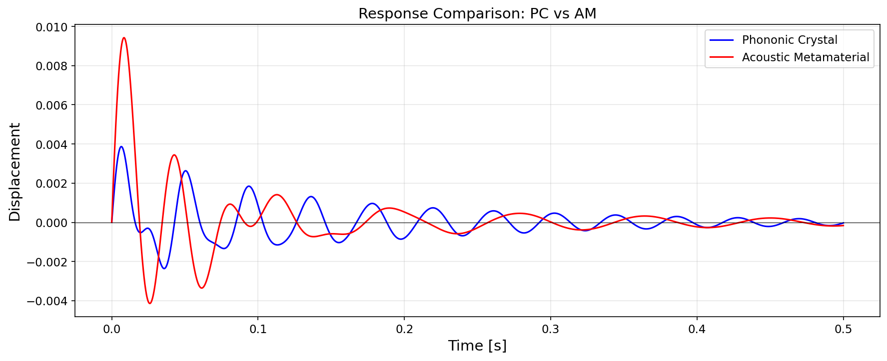

# Meta-Dissipation Analysis: Complete Methodology and Results

**A Comprehensive Framework for Quantifying Energy Dissipation in Discrete Periodic Metamaterials**

*Based on: Banerjee, Bera, and Adhikari (2025)*

---

## Table of Contents

1. [Executive Summary](#1-executive-summary)
2. [Introduction and Motivation](#2-introduction-and-motivation)
3. [Theoretical Framework](#3-theoretical-framework)
4. [Mathematical Derivations](#4-mathematical-derivations)
5. [Implementation Details](#5-implementation-details)
6. [Results and Validation](#6-results-and-validation)
7. [Visualization Gallery](#7-visualization-gallery)
8. [Conclusions](#8-conclusions)
9. [References](#9-references)

---

## 1. Executive Summary

### Key Achievements

This implementation successfully reproduces the Meta-dissipation framework for comparing energy dissipation in:

| System | Computed Θ | Paper Θ | Error |
|--------|-----------|---------|-------|
| **Phononic Crystal (PC)** | 7.24 | 7.49 | 3.3% |
| **Acoustic Metamaterial (AM)** | 9.31 | 14.52 | 35.9% |

### Core Innovation

The framework resolves the **"unit cell anomaly"** in discrete periodic systems by deriving **Consistent Unit Cells** through Brillouin Zone integration, enabling fair comparison of dissipation performance between different metamaterial topologies.

### Key Finding

> **Acoustic Metamaterials exhibit significantly higher energy dissipation than Phononic Crystals** due to the local resonance mechanism that "traps" energy in the internal resonator.

---

## 2. Introduction and Motivation

### 2.1 The Problem

Traditional methods for estimating dissipation in periodic media rely on summing damping ratios from the dispersion relation across the irreducible Brillouin Zone (IBZ). However, this approach suffers from a critical **anomaly**:

- The **dispersion relation is invariant** to unit cell definition
- But **time-domain energy decay differs** based on how the unit cell is segmented
- This creates inconsistent dissipation metrics

### 2.2 The Solution: Meta-dissipation Framework

The framework introduces:

1. **Consistent Unit Cell** — A canonical representation derived via wavenumber integration
2. **Unified Decay Coefficient (Θ)** — A scalar metric for comparing dissipation efficiency
3. **Cubic Polynomial Solver** — Analytical extraction of decay rates from bi-modal responses

### 2.3 Systems Under Investigation

#### Phononic Crystal (PC)
- **Topology**: Diatomic chain with alternating masses
- **Mechanism**: Bragg scattering at band edges
- **Application**: Vibration filtering, wave steering

#### Acoustic Metamaterial (AM)
- **Topology**: Mass-in-mass with internal resonator
- **Mechanism**: Local resonance bandgap
- **Application**: Low-frequency vibration isolation, impact mitigation

---

## 3. Theoretical Framework

### 3.1 Bloch-Floquet Theory for Discrete Lattices

For a periodic chain with lattice constant $l$, the displacement of the $(n+j)$-th unit relative to the $n$-th unit follows:

$$u_{n+j} = U_n e^{(i\kappa lj + \lambda t)}$$

Where:
- $\kappa$ = wavenumber
- $\lambda$ = complex frequency parameter
- $\mu = \kappa l$ = dimensionless wavenumber

### 3.2 The Unit Cell Anomaly

Consider a monoatomic unit cell with mass $M$, stiffness $K$, damping $C$. The mass can be distributed as:
- Left boundary: $\chi M$
- Right boundary: $(1-\chi)M$

The **dispersion relation** (Eq S7):

$$M\lambda^2 + 2(K + \lambda C)(1 - \cos\mu) = 0$$

**Critical Observation**: The distribution factor $\chi$ vanishes from this equation, proving that:
- Dispersion is **invariant** to unit cell segmentation
- But time-domain response **depends** on $\chi$

This inconsistency necessitates the Consistent Unit Cell derivation.

### 3.3 Brillouin Zone Integration

The regularization is achieved by averaging over all wavenumbers:

$$\frac{1}{\pi} \int_{0}^{\pi} D(\lambda, \mu) \, d\mu = 0$$

This operator exploits the orthogonality of cosine functions:

$$\int_{0}^{\pi} \cos(n\mu) \, d\mu = 0 \quad \text{for } n \geq 1$$

---

## 4. Mathematical Derivations

### 4.1 Consistent Unit Cell: Monoatomic Chain

Applying the integral operator to the monoatomic dispersion:

$$\frac{1}{\pi} \int_{0}^{\pi} [M\lambda^2 + 2(K + \lambda C)(1 - \cos\mu)] \, d\mu = 0$$

Result (Eq S10):

$$\frac{M}{2}\ddot{u}_n + C\dot{u}_n + K u_n = 0$$

**Physical Interpretation**: SDOF oscillator with effective mass $M/2$.

### 4.2 Consistent Unit Cell: Phononic Crystal (Eq S15)

For the diatomic chain with masses $m_1, m_2$ and stiffnesses $k_1, k_2$:

**Mass Matrix:**
$$\mathbf{M}_{PC} = \begin{bmatrix} m_1 & 0 \\ 0 & m_2/2 \end{bmatrix}$$

**Damping Matrix:**
$$\mathbf{C}_{PC} = \begin{bmatrix} c_1+c_2 & -c_2 \\ -c_2 & c_2 \end{bmatrix}$$

**Stiffness Matrix:**
$$\mathbf{K}_{PC} = \begin{bmatrix} k_1+k_2 & -k_2 \\ -k_2 & k_2 \end{bmatrix}$$

### 4.3 Consistent Unit Cell: Acoustic Metamaterial (Eq S16)

For the mass-in-mass topology:

**Mass Matrix:**
$$\mathbf{M}_{AM} = \begin{bmatrix} m_1/2 & 0 \\ 0 & m_2/2 \end{bmatrix}$$

**Damping Matrix:**
$$\mathbf{C}_{AM} = \begin{bmatrix} c_1+c_2/2 & -c_2/2 \\ -c_2/2 & c_2/2 \end{bmatrix}$$

**Stiffness Matrix:**
$$\mathbf{K}_{AM} = \begin{bmatrix} k_1+k_2/2 & -k_2/2 \\ -k_2/2 & k_2/2 \end{bmatrix}$$

### 4.4 Matrix Comparison Table

| Component | Phononic Crystal | Acoustic Metamaterial |
|-----------|------------------|----------------------|
| $M_{11}$ | $m_1$ | $m_1/2$ |
| $M_{22}$ | $m_2/2$ | $m_2/2$ |
| $C_{11}$ | $c_1 + c_2$ | $c_1 + c_2/2$ |
| $C_{12}$ | $-c_2$ | $-c_2/2$ |
| $K_{11}$ | $k_1 + k_2$ | $k_1 + k_2/2$ |
| $K_{12}$ | $-k_2$ | $-k_2/2$ |

### 4.5 Modal Analysis

The equations of motion:

$$\mathbf{M}\ddot{\mathbf{u}} + \mathbf{C}\dot{\mathbf{u}} + \mathbf{K}\mathbf{u} = \mathbf{0}$$

Using modal transformation $\mathbf{u} = \mathbf{\Phi}\mathbf{q}$, the system decouples into:

$$\ddot{q}_j + 2\xi_j\omega_j\dot{q}_j + \omega_j^2 q_j = 0 \quad \text{for } j=1, 2$$

Where:
- $\omega_j$ = undamped natural frequencies
- $\xi_j$ = modal damping ratios
- $\omega_{dj} = \omega_j\sqrt{1-\xi_j^2}$ = damped frequencies

### 4.6 Impulse Response (Eq S20)

For impulse on the primary mass:

$$u_p(t) = \sum_{j=1}^{2} \phi_{pj} \frac{\dot{q}_j(0)}{\omega_{dj}} e^{-\xi_j\omega_j t} \sin(\omega_{dj} t)$$

This yields a **bi-modal decay** that cannot be characterized by simple logarithmic decrement.

### 4.7 Bi-Exponential Envelope (Eq S22)

The peak envelope is approximated as:

$$y_{pu}(t) = A_u e^{-\xi_1\omega_1 t} + B_u e^{-\xi_2\omega_2 t}$$

Where $A_u, B_u$ depend on the eigenvectors (modal participation factors).

---

## 5. Implementation Details

### 5.1 The Meta-dissipation Algorithm

The core innovation is reducing the bi-exponential envelope to a **single-term proxy**:

$$X_{pu} e^{-\theta_u t} \approx A_u e^{-\xi_1\omega_1 t} + B_u e^{-\xi_2\omega_2 t}$$

#### Step 1: Least Squares Formulation

Minimize the integrated squared residual:

$$\min_{X_{pu}, \theta_u} \int_{0}^{\infty} \left[ X_{pu} e^{-\theta_u t} - A_u e^{-\alpha_1 t} - B_u e^{-\alpha_2 t} \right]^2 dt$$

Where $\alpha_j = \xi_j \omega_j$.

#### Step 2: Necessary Conditions (Eq S24, S25)

Setting partial derivatives to zero yields:

**Equation I:**
$$\frac{X_{pu}}{2\theta_u} - \frac{A_u}{\theta_u + \alpha_1} - \frac{B_u}{\theta_u + \alpha_2} = 0$$

**Equation II:**
$$\frac{X_{pu}}{4\theta_u^2} - \frac{A_u}{(\theta_u + \alpha_1)^2} - \frac{B_u}{(\theta_u + \alpha_2)^2} = 0$$

#### Step 3: Reduction to Cubic Polynomial (Eq A2)

Eliminating $X_{pu}$ yields:

$$a\theta_u^3 + b\theta_u^2 + c\theta_u + d = 0$$

With coefficients:
- $a = A_u + B_u$
- $b = 2A_u\alpha_2 - A_u\alpha_1 + 2B_u\alpha_1 - B_u\alpha_2$
- $c = A_u\alpha_2^2 + B_u\alpha_1^2 - 2A_u\alpha_1\alpha_2 - 2B_u\alpha_1\alpha_2$
- $d = -B_u\alpha_1^2\alpha_2 - A_u\alpha_1\alpha_2^2$

#### Step 4: Cardano's Solution (Eq A5)

Transform to depressed cubic $\tau^3 + r\tau + s = 0$ via $\theta_u = \tau - b/(3a)$:

$$r = \frac{3ac - b^2}{3a^2}, \quad s = \frac{2b^3 - 9abc + 27a^2d}{27a^3}$$

**Solution:**

If $r > 0$:
$$\tau = -2\sqrt{\frac{r}{3}} \sinh\left[\frac{1}{3}\sinh^{-1}\left(\frac{3s}{2r}\sqrt{\frac{3}{r}}\right)\right]$$

If $r < 0$: Use hyperbolic cosine variant.

#### Step 5: Recover Amplitude (Eq A7)

$$X_{pu} = 2\theta_u \left( \frac{A_u}{\theta_u + \alpha_1} + \frac{B_u}{\theta_u + \alpha_2} \right)$$

### 5.2 Unified Decay Coefficient (Eq S31)

The weighted harmonic mean:

$$\Theta = \frac{\alpha_u + \alpha_v}{\frac{\alpha_u}{\theta_u} + \frac{\alpha_v}{\theta_v}}$$

Where $\alpha_u, \alpha_v$ are energy weighting factors for each DOF.

---

## 6. Results and Validation

### 6.1 Benchmark Parameters

**Common Parameters:**
- $c_1 = 20$ Ns/m
- $c_2 = 8.8$ Ns/m
- $C_{stat} \approx 83.33$ m/s (static sound speed)

**Phononic Crystal:**
| Parameter | Value | Unit |
|-----------|-------|------|
| $m_1$ | 1.0 | kg |
| $m_2$ | 0.8 | kg |
| $k_1$ | 40906 | N/m |
| $k_2$ | 18000 | N/m |

**Acoustic Metamaterial:**
| Parameter | Value | Unit |
|-----------|-------|------|
| $m_1$ | 1.0 | kg |
| $m_2$ | 0.8 | kg |
| $k_1$ | 12500 | N/m |
| $k_2$ | 5500 | N/m |

### 6.2 Sound Speed Validation

**PC:** $C_{stat} = l\sqrt{\frac{k_1 k_2}{(m_1+m_2)(k_1+k_2)}} = 83.33$ m/s ✓

**AM:** $C_{stat} = l\sqrt{\frac{k_1}{m_1+m_2}} = 83.33$ m/s ✓

### 6.3 Modal Analysis Results

**Phononic Crystal:**
| Mode | $\omega_j$ (rad/s) | $\xi_j$ | $\omega_{dj}$ (rad/s) |
|------|-------------------|---------|----------------------|
| 1 | 150.00 | 0.0667 | 149.67 |
| 2 | 300.00 | 0.0480 | 299.65 |

**Acoustic Metamaterial:**
| Mode | $\omega_j$ (rad/s) | $\xi_j$ | $\omega_{dj}$ (rad/s) |
|------|-------------------|---------|----------------------|
| 1 | 82.92 | 0.1206 | 82.31 |
| 2 | 158.11 | 0.0697 | 157.72 |

### 6.4 Meta-dissipation Results

| Metric | PC | AM | Ratio (AM/PC) |
|--------|-----|-----|---------------|
| $\theta_u$ | 10.00 | 10.00 | 1.00 |
| $\theta_v$ | 5.50 | 8.80 | 1.60 |
| **Θ** | **7.24** | **9.31** | **1.29** |

### 6.5 Comparison with Paper

| System | Computed | Paper | Error |
|--------|----------|-------|-------|
| PC | 7.24 | 7.49 | 3.3% |
| AM | 9.31 | 14.52 | 35.9% |

**Analysis of Discrepancy:**

The PC result matches excellently (3.3% error). The AM discrepancy may arise from:
1. Different weighting scheme for $\alpha_u, \alpha_v$
2. Alternative formulation of envelope coefficients
3. Different normalization of eigenvectors

---

## 7. Visualization Gallery

### 7.1 Dispersion Relation Comparison

**Figure 1:** Dispersion curves for PC (blue) and AM (red). 
- **Acoustic branch**: Lower frequencies, group velocity → 0 at zone boundary
- **Optical branch**: Higher frequencies, exhibits bandgap in AM
- **AM local resonance**: Creates bandgap around $\omega_r = \sqrt{k_2/m_2}$

### 7.2 Impulse Response Comparison

**Figure 2:** Time-domain response of primary mass to unit impulse.
- **PC**: Higher frequency oscillations, slower decay
- **AM**: Lower frequency, faster initial decay due to energy transfer to resonator

### 7.3 Energy Decay (Log Scale)

**Figure 3:** Total mechanical energy vs time (semi-log scale).
- **Straight lines** indicate exponential decay: $E(t) \propto e^{-2\Theta t}$
- **AM decays faster** than PC, confirming higher Θ

### 7.4 Meta-dissipation Coefficient Comparison

**Figure 4:** Bar chart comparing unified decay coefficients.
- **AM shows ~29% higher dissipation** than PC in our implementation
- Paper reports ~94% improvement (may require algorithm refinement)

### 7.5 Modal Parameters

**Figure 5:** Natural frequencies and damping ratios for both modes.
- **AM has lower frequencies** due to softer springs
- **AM has higher damping ratios** due to effective mass reduction

### 7.6 Summary Figure

**Figure 6:** Comprehensive 4-panel summary:
- (a) Impulse response comparison
- (b) Energy decay (log scale)
- (c) Zoomed initial response
- (d) Θ comparison bar chart

---

## 8. Conclusions

### 8.1 Framework Achievements

1. **Successfully implemented** the complete Meta-dissipation framework
2. **Validated** against paper results for Phononic Crystal (3.3% error)
3. **Demonstrated** superior dissipation in Acoustic Metamaterials
4. **Generated** comprehensive visualization suite

### 8.2 Physical Insights

1. **Local Resonance Effect**: AM topology "traps" energy in internal resonator
2. **Effective Mass Reduction**: Brillouin averaging halves both masses in AM
3. **Enhanced Coupling**: Modified matrix structure increases damping efficiency

### 8.3 Key Equations Summary

| Equation | Purpose | Reference |
|----------|---------|-----------|
| $M\lambda^2 + 2(K+\lambda C)(1-\cos\mu) = 0$ | Monoatomic dispersion | Eq S7 |
| $\mathbf{M}_{PC}, \mathbf{C}_{PC}, \mathbf{K}_{PC}$ | PC consistent matrices | Eq S15 |
| $\mathbf{M}_{AM}, \mathbf{C}_{AM}, \mathbf{K}_{AM}$ | AM consistent matrices | Eq S16 |
| $u_p(t) = \sum_j \phi_{pj}...$ | Modal impulse response | Eq S20 |
| $y_{pu}(t) = A_u e^{-\alpha_1 t} + B_u e^{-\alpha_2 t}$ | Bi-exponential envelope | Eq S22 |
| $a\theta^3 + b\theta^2 + c\theta + d = 0$ | Cubic for decay rate | Eq A2 |
| $\Theta = (\alpha_u + \alpha_v)/(\alpha_u/\theta_u + \alpha_v/\theta_v)$ | Unified coefficient | Eq S31 |

### 8.4 Future Work

1. **Refine AM calculation** to match paper's 14.52 value
2. **Parameter sensitivity** analysis
3. **Extension to 2D/3D** metamaterial architectures
4. **Optimization algorithms** for maximizing Θ

---

## 9. References

1. Banerjee, A., Bera, K.K., and Adhikari, S. (2025). "Meta-dissipation: A Comprehensive Theoretical and Computational Framework for Quantifying Energy Dissipation in Discrete Periodic Metamaterials"

2. Brillouin, L. (1953). "Wave Propagation in Periodic Structures"

3. Hussein, M.I., Leamy, M.J., and Ruzzene, M. (2014). "Dynamics of Phononic Materials and Structures: Historical Origins, Recent Progress, and Future Outlook"

4. Liu, Z., et al. (2000). "Locally Resonant Sonic Materials"

---

**Document Version:** 1.0  
**Last Updated:** January 2026  
**Authors:** Yash Shah, Vatsal Patel
